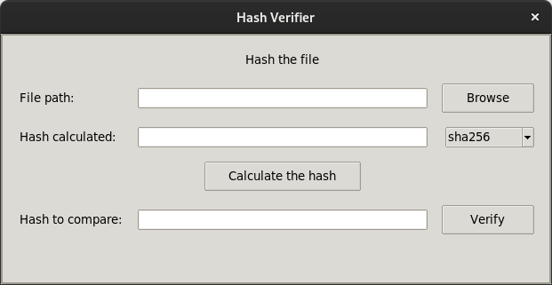

                  _               _                      _  __ _           
                 | |             | |                    (_)/ _(_)          
                 | |__   __ _ ___| |__   __   _____ _ __ _| |_ _  ___ _ __ 
                 | '_ \ / _` / __| '_ \  \ \ / / _ \ '__| |  _| |/ _ \ '__|
                 | | | | (_| \__ \ | | |  \ V /  __/ |  | | | | |  __/ |   
                 |_| |_|\__,_|___/_| |_|   \_/ \___|_|  |_|_| |_|\___|_|   
                                                                           


## screenshot: 




## What is it?

**hash verifier** is a python program that verifies the hash of a file. 

It uses the library [hashlib](https://docs.python.org/3/library/hashlib.html) to generate the hash using the available algorithms.

## Getting started:

#### To initiate the application, just run:

```

python3 main.py

```


```


                                                            
